# LibriVault Cloud Deployment Architecture

## 🌐 Complete Cloud Deployment Flow

```mermaid
graph TB
    %% Developer Workflow
    DEV[👨‍💻 Developer] --> GIT[📁 Git Push to GitHub]
    
    %% GitHub Actions CI/CD Pipeline
    GIT --> GA[🔄 GitHub Actions CI/CD]
    
    subgraph "GitHub Actions Pipeline"
        GA --> TEST[🧪 Test Stage<br/>- Backend Compilation<br/>- Frontend Build]
        TEST --> BUILD[🏗️ Build & Push Stage<br/>- Docker Build Backend<br/>- Docker Build Frontend<br/>- Push to Docker Hub]
        BUILD --> DEPLOY[🚀 Deploy Stage<br/>- SSH to EC2<br/>- Docker Compose Deploy]
    end
    
    %% Docker Hub
    BUILD --> DOCKER[🐳 Docker Hub<br/>- Backend Image<br/>- Frontend Image]
    
    %% AWS Cloud Infrastructure
    subgraph "AWS Cloud"
        subgraph "EC2 Instance"
            DEPLOY --> EC2[🖥️ EC2 Ubuntu Server<br/>- Docker Engine<br/>- Docker Compose<br/>- Auto-configured via User Data]
            
            EC2 --> COMPOSE[🐙 Docker Compose Orchestration]
            
            subgraph "Container Services"
                COMPOSE --> DB[🗄️ MySQL Container<br/>Port: 3308<br/>- User Data<br/>- Book Records<br/>- Subscriptions]
                COMPOSE --> BACKEND[⚙️ Spring Boot Backend<br/>Port: 8080<br/>- REST APIs<br/>- Business Logic<br/>- Authentication]
                COMPOSE --> FRONTEND[🎨 Angular Frontend<br/>Port: 4200<br/>- User Interface<br/>- Admin Dashboard<br/>- Reader Portal]
            end
        end
        
        %% AWS S3 for File Storage
        S3[📚 AWS S3 Bucket<br/>- PDF Books<br/>- Cover Images<br/>- File Storage]
        BACKEND --> S3
    end
    
    %% External Services
    subgraph "External Services"
        STRIPE[💳 Stripe<br/>- Payment Processing<br/>- Subscription Billing]
        GMAIL[📧 Gmail SMTP<br/>- Email Notifications<br/>- User Communications]
    end
    
    BACKEND --> STRIPE
    BACKEND --> GMAIL
    
    %% User Access
    subgraph "User Access"
        USERS[👥 End Users<br/>- Readers<br/>- Librarians<br/>- Administrators]
        USERS --> FRONTEND
    end
    
    %% Network Flow
    FRONTEND -.->|API Calls| BACKEND
    BACKEND -.->|Database Queries| DB
    
    %% Styling
    classDef aws fill:#FF9900,stroke:#232F3E,stroke-width:2px,color:#fff
    classDef docker fill:#2496ED,stroke:#fff,stroke-width:2px,color:#fff
    classDef github fill:#24292e,stroke:#fff,stroke-width:2px,color:#fff
    classDef external fill:#28a745,stroke:#fff,stroke-width:2px,color:#fff
    classDef container fill:#0066cc,stroke:#fff,stroke-width:2px,color:#fff
    
    class EC2,S3 aws
    class DOCKER,COMPOSE docker
    class GIT,GA,TEST,BUILD,DEPLOY github
    class STRIPE,GMAIL external
    class DB,BACKEND,FRONTEND container
```

## 🔧 Infrastructure Components

### **Development & CI/CD**
- **GitHub Repository**: Source code management
- **GitHub Actions**: Automated CI/CD pipeline
- **Docker Hub**: Container image registry

### **AWS Infrastructure**
- **EC2 Instance**: Ubuntu server hosting the application
- **S3 Bucket**: File storage for PDFs and images
- **Security Groups**: Network access control

### **Application Stack**
- **MySQL Database**: User data, books, subscriptions
- **Spring Boot Backend**: REST APIs, business logic
- **Angular Frontend**: User interface and dashboards

### **External Integrations**
- **Stripe**: Payment processing and subscriptions
- **Gmail SMTP**: Email notifications

## 🚀 Deployment Flow Steps

1. **Code Push** → GitHub repository
2. **CI/CD Trigger** → GitHub Actions pipeline
3. **Build Images** → Docker containers
4. **Push to Registry** → Docker Hub
5. **Deploy to Cloud** → EC2 instance
6. **Container Orchestration** → Docker Compose
7. **Service Health Checks** → Automated verification
8. **Live Application** → Public access

## 🔐 Security & Configuration

- **17 GitHub Secrets** for secure credential management
- **Environment Variables** for configuration
- **Health Checks** for service monitoring
- **Firewall Rules** for network security

## 📊 Monitoring & Maintenance

- **Container Health Checks**: Automated service monitoring
- **Log Management**: Centralized logging
- **Automatic Restarts**: Service reliability
- **Image Updates**: Automated deployments

---

**🌟 Result**: A fully automated, scalable, and secure cloud deployment for LibriVault Digital Library System!